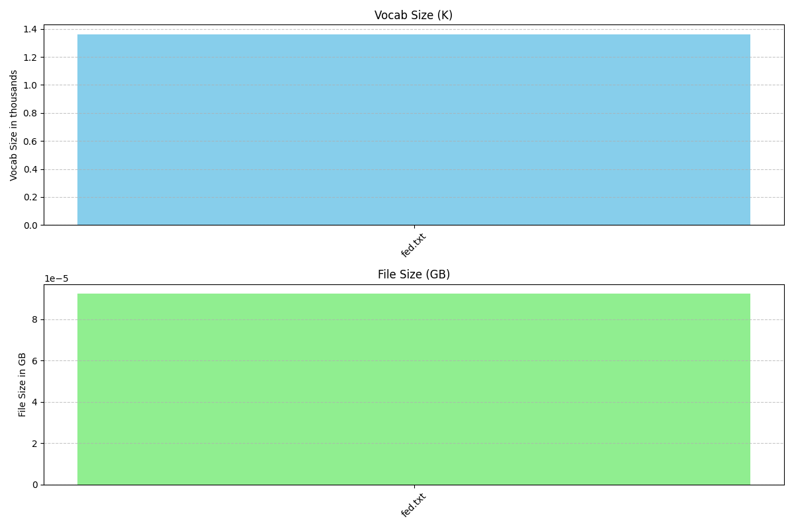

<center>


# 🦢 swan
superfast web acquisition network - <small>toolkit for 🐍-tier data acquisition</small>


<small>high-efficiency text & file scraper with smart tracking, client/server networking for building language model datasets __*fast*__  🌊</small>

<a href="https://huggingface.co/datasets/dylanalloy/swan" target="_blank">swan-financial dataset repo on 🤗</a>

</center>

## 💻 install

```shell
python setup.py install
```
```shell
running install
...
Finished processing dependencies for swan==0.0.1
```

## ⚡️ usage

<small>🦢 check .json configs!</small>

<details><summary>Single File</summary>

```python
from swan import swan
auto = swan.Swan('./config.json')
run = auto.go()
print(run)
auto.destroy('example')
```
```shell
🌊 SUCCESS: config set from - ./example.json
ℹ️ INFO: config saved to - /Users/dylanmoore/VSCode/LLM/swan_scrape.git/example
🌊 SUCCESS: unboxed! 🦢📦 - /Users/dylanmoore/VSCode/LLM/swan_scrape.git/example 
☕️ WAIT: swanning with "example"
ℹ️ INFO: Copier initialized
ℹ️ INFO: Receipts initialized
ℹ️ INFO: Janitor initialized
ℹ️ INFO: written - /Users/dylanmoore/VSCode/LLM/swan_scrape.git/example/fomchistorical2017.htm
[{'file': 'https://www.federalreserve.gov/monetarypolicy/fomchistorical2017.htm', 'path': '/Users/dylanmoore/VSCode/LLM/swan_scrape.git/example/fomchistorical2017.htm'}]
☕️ WAIT: setting header with `.keys()`
🌊 SUCCESS: headers detected as ['file', 'path'] from `.keys()`
ℹ️ INFO: created /Users/dylanmoore/VSCode/LLM/swan_scrape.git/example/receipts.csv
ℹ️ INFO: timestamped - 2023-09-05 06:36:57.003699
🌊 SUCCESS: 1 written to /Users/dylanmoore/VSCode/LLM/swan_scrape.git/example/receipts.csv
ℹ️ INFO: written - /Users/dylanmoore/VSCode/LLM/swan_scrape.git/example/fomchistorical2017_cleaned.txt
🌊 SUCCESS: 🦢 done
{'config': <swan.config.Config object at 0x10fde00d0>, 'copier': <swan.copier.Copier object at 0x10e588d50>, 'receipts': <swan.receipts.Receipts object at 0x10fddb0d0>, 'janitor': <swan.janitor.Janitor object at 0x106c6af90>, 'data': [{'file': 'https://www.federalreserve.gov/monetarypolicy/fomchistorical2017.htm', 'path': '/Users/dylanmoore/VSCode/LLM/swan_scrape.git/example/fomchistorical2017.htm', 'ts': datetime.datetime(2023, 9, 5, 6, 36, 57, 3699)}], 'status': 'complete'}
🚨 WARN: example destroyed
```

</details>

<details>
<summary>Recursive/Batch Processing</summary>


```python
from swan import swan
auto = swan.Swan('./recurse.example.json')
run = auto.go()
print(run)
auto.destroy('recurse_example')
```
```shell
🌊 SUCCESS: config set from - ./recurse.example.json
ℹ️ INFO: config saved to - /Users/dylanmoore/VSCode/LLM/swan_scrape.git/recurse_example
🌊 SUCCESS: unboxed! 🦢📦 - /Users/dylanmoore/VSCode/LLM/swan_scrape.git/recurse_example 
☕️ WAIT: swanning with "recurse_example"
ℹ️ INFO: Copier initialized
ℹ️ INFO: Receipts initialized
ℹ️ INFO: Janitor initialized
☕️ WAIT: processing https://www.federalreserve.gov/monetarypolicy/fomchistorical2017.htm
100%|██████████| 326/326 [00:00<00:00, 196344.50it/s]
ℹ️ INFO: found - https://www.federalreserve.gov/monetarypolicy/beigebook/files/Beigebook_20170118.pdf
ℹ️ INFO: found - https://www.federalreserve.gov/monetarypolicy/files/FOMC20170201tealbooka20170123.pdf
ℹ️ INFO: found - https://www.federalreserve.gov/monetarypolicy/files/FOMC20170201tealbookb20170126.pdf
ℹ️ INFO: found - https://www.federalreserve.gov/monetarypolicy/files/FOMC20170201Agenda.pdf
ℹ️ INFO: found - https://www.federalreserve.gov/monetarypolicy/files/FOMC_LongerRunGoals_201701.pdf
...
ℹ️ INFO: found - https://www.federalreserve.gov/monetarypolicy/files/FOMC20170503tealbookb20170427.pdf
ℹ️ INFO: found - https://www.federalreserve.gov/monetarypolicy/files/FOMC20170503Agenda.pdf
ℹ️ INFO: found - https://www.federalreserve.gov/monetarypolicy/files/fomcminutes20170503.pdf
ℹ️ INFO: found - https://www.federalreserve.gov/monetarypolicy/files/FOMC20170503meeting.pdf
ℹ️ INFO: found - https://www.federalreserve.gov/monetarypolicy/files/FOMC20170503material.pdf
ℹ️ INFO: found - https://www.federalreserve.gov/monetarypolicy/files/BeigeBook_20170531.pdf
...
ℹ️ INFO: timestamped - 2023-09-05 06:41:52.462400
ℹ️ INFO: timestamped - 2023-09-05 06:41:52.462402
🌊 SUCCESS: 65 written to /Users/dylanmoore/VSCode/LLM/swan_scrape.git/recurse_example/receipts.csv
ℹ️ INFO: written - /Users/dylanmoore/VSCode/LLM/swan_scrape.git/recurse_example/Beigebook_20170118_cleaned.txt
Output is truncated. View as a scrollable element or open in a text editor. Adjust cell output settings...

ℹ️ INFO: written - /Users/dylanmoore/VSCode/LLM/swan_scrape.git/recurse_example/FOMC20170201tealbooka20170123_cleaned.txt
ℹ️ INFO: written - /Users/dylanmoore/VSCode/LLM/swan_scrape.git/recurse_example/FOMC20170201tealbookb20170126_cleaned.txt
ℹ️ INFO: written - /Users/dylanmoore/VSCode/LLM/swan_scrape.git/recurse_example/FOMC20170201Agenda_cleaned.txt
ℹ️ INFO: written - /Users/dylanmoore/VSCode/LLM/swan_scrape.git/recurse_example/FOMC_LongerRunGoals_201701_cleaned.txt
ℹ️ INFO: written - /Users/dylanmoore/VSCode/LLM/swan_scrape.git/recurse_example/fomcminutes20170201_cleaned.txt
ℹ️ INFO: written - /Users/dylanmoore/VSCode/LLM/swan_scrape.git/recurse_example/FOMC20170201meeting_cleaned.txt
...
ℹ️ INFO: written - /Users/dylanmoore/VSCode/LLM/swan_scrape.git/recurse_example/FOMC20170503tealbooka20170421_cleaned.txt
ℹ️ INFO: written - /Users/dylanmoore/VSCode/LLM/swan_scrape.git/recurse_example/FOMC20170503tealbookb20170427_cleaned.txt
ℹ️ INFO: written - /Users/dylanmoore/VSCode/LLM/swan_scrape.git/recurse_example/FOMC20170503Agenda_cleaned.txt
ℹ️ INFO: written - /Users/dylanmoore/VSCode/LLM/swan_scrape.git/recurse_example/fomcminutes20170503_cleaned.txt
ℹ️ INFO: written - /Users/dylanmoore/VSCode/LLM/swan_scrape.git/recurse_example/FOMC20170503meeting_cleaned.txt
ℹ️ INFO: written - /Users/dylanmoore/VSCode/LLM/swan_scrape.git/recurse_example/FOMC20170503material_cleaned.txt
ℹ️ INFO: written - /Users/dylanmoore/VSCode/LLM/swan_scrape.git/recurse_example/BeigeBook_20170531_cleaned.txt
ℹ️ INFO: written - /Users/dylanmoore/VSCode/LLM/swan_scrape.git/recurse_example/FOMC20170614tealbooka20170605_cleaned.txt
...
ℹ️ INFO: written - /Users/dylanmoore/VSCode/LLM/swan_scrape.git/recurse_example/FOMC20171213material_cleaned.txt
🌊 SUCCESS: 🦢 done
{'config': <swan.config.Config object at 0x105301a10>, 'copier': <swan.copier.Copier object at 0x1041c3390>, 'receipts': <swan.receipts.Receipts object at 0x106792690>, 'janitor': <swan.janitor.Janitor object at 0x106792c90>, 'data': [{'file': 'https://www.federalreserve.gov/monetarypolicy/beigebook/files/Beigebook_20170118.pdf'...
🚨 WARN: recurse_example destroyed
```

</details>

#### old (many of these will be broken while being retrofitted)

<details>
<summary>single file & receipt creation, then deletion</summary>
<br>

```python
from swan.copier import Copier
from swan.receipts import Receipts
data = []
copy = Copier(url='https://www.federalreserve.gov/monetarypolicy/fomchistorical2017.htm')
if copy.download('./fed.txt'):
    data.append({"file":copy.url, "path":f'{copy.path}'})
receipts = Receipts(path='./fed.csv', data=data)
receipts.create(True)
receipts.write(False)
copy.destroy(confirm=copy.path.split('/')[-1])
receipts.destroy(confirm=receipts.path.split('/')[-1])
```
```shell
ℹ️ INFO: written - ./fed.txt
☕️ WAIT: no header set - attempting `.keys()`
🌊 SUCCESS: headers detected as ['file', 'path'] from `.keys()`
ℹ️ INFO: [file, path, ts] header used
ℹ️ INFO: created ./fed.csv
ℹ️ INFO: timestamped - 2023-08-31 17:07:19.544208
🌊 SUCCESS: 1 written to ./fed.csv
🚨 WARN: fed.txt destroyed from ./fed.txt
🚨 WARN: fed.csv destroyed from ./fed.csv
```

</details>

<details>
<summary>seek through receipts</summary>

```python
integer = receipts.seek(line=0)
string = receipts.seek(line='monetarypolicy')
by_date = receipts.seek(line='2023-08-31')
print(integer)
print(string)
print(by_date)
```
```shell
ℹ️ INFO: found monetarypolicy in data
ℹ️ INFO: found 2023-08-31 in data
{'file': 'https://www.federalreserve.gov/monetarypolicy/fomchistorical2017.htm', 'path': './fed.txt', 'ts': '2023-08-31 19:57:02.593086'}
[{'file': 'https://www.federalreserve.gov/monetarypolicy/fomchistorical2017.htm', 'path': './fed.txt', 'ts': '2023-08-31 19:57:02.593086'}]
[{'file': 'https://www.federalreserve.gov/monetarypolicy/fomchistorical2017.htm', 'path': './fed.txt', 'ts': '2023-08-31 19:57:02.593086'}]
```

</details>

<details>
<summary>recursive mode with three filetypes, and whole directory deletion</summary>

```python
from swan.copier import Copier
from swan.receipts import Receipts

copy = Copier(url='https://www.federalreserve.gov/monetarypolicy/fomchistorical2017.htm', recurse=True)
data=[]
files = copy.download('./fed', types=['csv','xml','pdf'])[0]
for file in files:
    data.append({"file":file, "path":f'{copy.path}/{file.split("/")[-1]}'})
receipts = Receipts('./fed.csv', data=data)
receipts.create(False)
receipts.write(False)
copy.destroy(confirm=copy.path.split('/')[-1])
receipts.destroy(confirm=receipts.path.split('/')[-1])
```
```shell
☕️ WAIT: processing https://www.federalreserve.gov/monetarypolicy/fomchistorical2017.htm
100%|██████████| 326/326 [00:00<00:00, 154066.83it/s]
ℹ️ INFO: found - https://www.federalreserve.gov/monetarypolicy/beigebook/files/Beigebook_20170118.pdf
ℹ️ INFO: found - https://www.federalreserve.gov/monetarypolicy/files/FOMC20170201tealbooka20170123.pdf
ℹ️ INFO: found - https://www.federalreserve.gov/monetarypolicy/files/FOMC20170201tealbookb20170126.pdf
...
ℹ️ INFO: found - https://www.federalreserve.gov/monetarypolicy/files/FOMC20171213SEPcompilation.pdf
ℹ️ INFO: found - https://www.federalreserve.gov/monetarypolicy/files/FOMC20171213SEPkey.pdf
ℹ️ INFO: found - https://www.federalreserve.gov/monetarypolicy/files/FOMC20171213meeting.pdf
ℹ️ INFO: found - https://www.federalreserve.gov/monetarypolicy/files/FOMC20171213material.pdf

Output is truncated. View as a scrollable element or open in a text editor. Adjust cell output settings...

ℹ️ INFO: written - ./fed/Beigebook_20170118.pdf
ℹ️ INFO: written - ./fed/FOMC20170201tealbooka20170123.pdf
ℹ️ INFO: written - ./fed/FOMC20170201tealbookb20170126.pdf
ℹ️ INFO: written - ./fed/FOMC20170201Agenda.pdf
ℹ️ INFO: written - ./fed/FOMC_LongerRunGoals_201701.pdf
ℹ️ INFO: written - ./fed/fomcminutes20170201.pdf
ℹ️ INFO: written - ./fed/FOMC20170201meeting.pdf
ℹ️ INFO: written - ./fed/FOMC20170201material.pdf
ℹ️ INFO: written - ./fed/Beigebook_20170301.pdf
ℹ️ INFO: written - ./fed/FOMC20170315tealbooka20170303.pdf
ℹ️ INFO: written - ./fed/FOMC20170315tealbookb20170309.pdf
ℹ️ INFO: written - ./fed/FOMC20170315Agenda.pdf
...
ℹ️ INFO: timestamped - 2023-08-31 16:40:37.573578
🌊 SUCCESS: 65 written to ./fed.csv
🚨 WARN: 65 destroyed from ./fed
🚨 WARN: fed.csv destroyed from ./fed.csv
```

</details>

<details>
<summary>example custom anonymous function</summary>

```python
from swan.supplies import Custom
data = 'linkbase:hello there'
SECSifter = Custom(copy=data)

SECSifter.sift = lambda _: '' if _.startswith('linkbase:') else _

sifted = SECSifter.sift(data)
print(sifted)
```
```shell
```

</details>

<details>
<summary>rendering markdown handler</summary>

```python
data = '<html>hello there</html>'
from swan.supplies import Broom
clean = Broom(copy=data).sweep()
print(clean)
xml = '<TITLE>hello there</TITLE>'
clean = Broom(copy=xml).sweep(xml=True)
print(clean)
```
```shell
hello there
TITLE: hello there
```

</details>

<details>
<summary>pure text formatter</summary>

```python
from swan.janitor import Janitor
worker = Janitor(path='./fed.txt', o='./fed_processed.txt')
worker.process()
worker.destroy(confirm=worker.o.split('/')[-1])
```
```shell
ℹ️ INFO: written - ./fed_processed.txt
🚨 WARN: fed_processed.txt destroyed from ./fed_processed.txt
```

</details>

<details>
<summary>dataset statistics</summary>

```python
from swan.teacher import SP

copy = './fed.txt'
save='./plot.png'

p = SP(copy, save)
p.generate(show=True)
p.destroy(confirm=p.save.split('/')[-1])
```

```shell
🚨 WARN: plot.png destroyed from ./plot.png
```

</details>

#### 🤓 advanced configuration & job planning (many of these will be broken while being retrofitted)

<details><summary>declare existing config from file</summary>

```python
from swan.config import Config
example = Config("./config.json")
```
##### put it in memory
```python
conf = example.use()
_l = lambda _: list(_)
print(_l(conf.keys()))
print(conf["settings"]["name"])
```
##### change a value & save
```python
conf["settings"]["name"] = 'example'
example.save()
```
##### remove from memory
```python
c, conf = (None, None)
```
##### load from f/s again
```python
c = Config("./config.json")
conf = c.use()
role, name = conf['role'], conf['settings']['name']
```
##### see that the value has changed
```python
print(f'{role}: {name}')
```
```shell
🌊 SUCCESS: config loaded from - ./config.json
['role', 'settings']
fin-swan
🌊 SUCCESS: config saved to - ./config.json (overwrite)
🌊 SUCCESS: config loaded from - ./config.json
server: example
```

</details>

<details><summary>overrides</summary>

```python
example.unbox(True)
example.unbox()
example.destroy()
```
```shell
🌊 SUCCESS: unboxed! 🦢📦 - /Users/dylanmoore/VSCode/LLM/swan_scrape.git/example 
☠️ FATAL: exists - /Users/dylanmoore/VSCode/LLM/swan_scrape.git/example
🚨 WARN: example destroyed
```

</details>

<details><summary>initialize from memory i.e. API response</summary>

```python
fin_conf = {
    "role": "server",
    "settings": {
        "name": "fin-swan",
        "proj_dir": "/Users/dylanmoore/VSCode/LLM/swan_scrape.git/",
        "jobs": [
            {
                "url": "https://www.federalreserve.gov/monetarypolicy/fomchistorical2017.htm",
                "types": [],
                "janitor": 0,
                "custom": [
                    {
                        "func": ""
                        , "types": [""]
                    }
                ]
            }
        ]
    }
}
direct_load = Config(fin_conf)
direct_load.use()
direct_load.destroy('fin-swan')
```
```shell
🌊 SUCCESS: unboxed! 🦢📦 using - /Users/dylanmoore/VSCode/LLM/swan_scrape.git/fin-swan 
🌊 SUCCESS: config loaded from - /Users/dylanmoore/VSCode/LLM/swan_scrape.git/fin-swan/config.json
🚨 WARN: fin-swan destroyed
```
</details>

<details><summary>all together now 🎶</summary>

```python
# all together now 🎶
from swan.copier import Copier
from swan.receipts import Receipts
from swan.config import Config
from swan.janitor import Janitor
import os

fin_conf = {
    "role": "server",
    "settings": {
        "name": "fin-swan",
        "proj_dir": "/Users/dylanmoore/VSCode/LLM/swan_scrape.git/",
        "jobs": [
            {
                "url": "https://www.federalreserve.gov/monetarypolicy/fomchistorical2017.htm",
                "types": [],
                "janitor": 0,
                "custom": [
                    {
                        "func": ""
                        , "types": [""]
                    }
                ]
            }
        ]
    }
}
direct_load = Config(fin_conf)
c = direct_load.use()
p = os.path.join(c['settings']['proj_dir'], c['settings']['name'])
data = []
for job in c['settings']['jobs']:
    copy = Copier(url=job['url'])
    if copy.download(p+'/fed.txt'):
        data.append({"file":copy.url, "path":f'{copy.path}'})
receipts = Receipts(path=p+'/fed.csv', data=data)
receipts.create(True)
receipts.write(False)
worker = Janitor(p+'/fed.txt', o=p+'/fed_processed.txt')
worker.process()
```
```shell
🌊 SUCCESS: unboxed! 🦢📦 using - /Users/dylanmoore/VSCode/LLM/swan_scrape.git/fin-swan 
🌊 SUCCESS: config loaded from - /Users/dylanmoore/VSCode/LLM/swan_scrape.git/fin-swan/config.json
ℹ️ INFO: written - /Users/dylanmoore/VSCode/LLM/swan_scrape.git/fin-swan/fed.txt
🚨 WARN: path not found
☕️ WAIT: no header set - attempting `.keys()`
🌊 SUCCESS: headers detected as ['file', 'path'] from `.keys()`
ℹ️ INFO: [file, path, ts] header used
ℹ️ INFO: created /Users/dylanmoore/VSCode/LLM/swan_scrape.git/fin-swan/fed.csv
ℹ️ INFO: timestamped - 2023-09-01 17:28:27.786525
🌊 SUCCESS: 1 written to /Users/dylanmoore/VSCode/LLM/swan_scrape.git/fin-swan/fed.csv
```
</details>

<details><summary>💣</summary>

```python
# that easy
direct_load.destroy('fin-swan')
```
```shell
🚨 WARN: fin-swan destroyed
```

</details>

## 📝 needs

- [ ] worker/server engineering
    - [ ] finish `Fax` -> [NATS docs](https://natsbyexample.com), [py client](https://github.com/nats-io/nats.py)
- [x] good readme
- [x] config template / management
    - [ ] optional encryption of config unboxings
- [ ] tests 😢
    - [ ] move more to `.utils`
    - [ ] if / ternary conventions
- [ ] implement API response option for `Copier`
    - [ ] custom header arg for `Copier`
- [ ] add multiprocessing where needed
    - [ ] put `tqdm` in the right places
